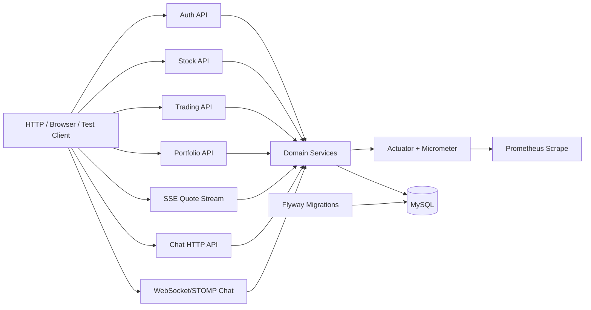

# Architecture Overview

## Purpose

This document gives a reviewer a fast structural view of the implemented backend without going deep into every phase document.

## High-Level Components

## Package-Level Layout

- `auth`
  signup, login, user repository
- `stock`
  stock reads, mock quote generation, SSE quote stream
- `trading`
  buy/sell mutations, trade history reads, cursor history path
- `portfolio`
  holdings read model
- `chat`
  room list, message history, join flow, STOMP message handling
- `monitoring`
  custom meters, room subscription metrics, Prometheus-compatible endpoint
- `config`, `exception`, `response`, `security`
  shared application infrastructure

## Main Runtime Flows

### Trading flow

1. HTTP request reaches `TradingController`.
2. `TradingService` validates cash or holding quantity.
3. User, holding, and trade-order state are updated transactionally.
4. Trade metrics record request and validation outcomes.

### Quote streaming flow

1. A client subscribes to `GET /api/v1/quotes/stream`.
2. `QuoteStreamService` registers the SSE emitter.
3. The mock quote generator updates stock prices.
4. Quote publish metrics record cycles, recipients, failures, and latency.

### Chat flow

1. A user joins a stock room through HTTP.
2. The client connects to `/ws` and subscribes to `/sub/chat/rooms/{roomId}`.
3. Messages are sent to `/pub/chat/rooms/{roomId}`.
4. Chat persistence updates room metadata and metrics capture send count, latency, and room subscription skew.

## Data Design Notes

- `users`, `holdings`, and `trade_orders` support the trading consistency story.
- `stocks` stores the current display price used by list/detail reads and SSE snapshots.
- `chat_rooms`, `chat_room_members`, and `chat_messages` support room membership and history reads.
- `trade_orders (user_id, id)` was added to support the cursor-based trade-history path.
- Read-heavy endpoints use DTOs and projection-oriented queries when the entity path becomes measurably expensive.

## Why The Structure Fits The Portfolio Goal

- It is simple enough to explain quickly.
- It still shows meaningful backend concerns: consistency, query design, protocol choice, and observability.
- Each major area maps cleanly to a documented phase and a reproducible technical story.

## Related Docs

- [README.md](../README.md)
- [03-api-spec.md](03-api-spec.md)
- [22-portfolio-summary.md](22-portfolio-summary.md)
- [23-interview-qna.md](23-interview-qna.md)
